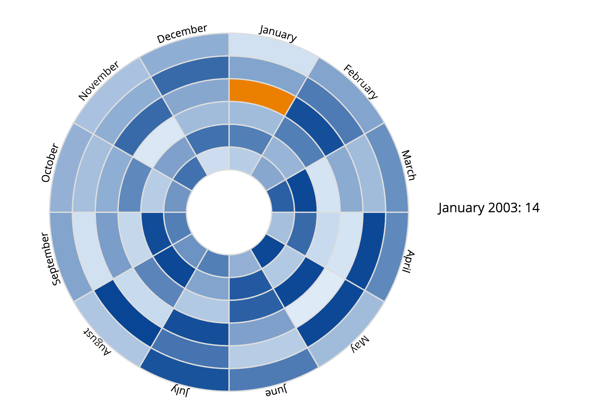

# info474-software-design

## CCChart (Circular Calendar Chart)
Circular Calendar Charts are good for representing monthly data across multiple years. An example is shown below representing random values for each month from 2000 to 2005.



## General usage
This chart requires a data-join with an array of objects. Below is an example of the object:

```javascript
{
    month: "January",
    year: 2005,
    value: 100
}
```

A few notes on the object:
- `month` must be a string with first letter capitalized
- `year` must be a number
- `value` must be a number

## Chart functions

\# *CCChart*()
> Constructs a Circular Calendar Chart and returns itself.

\# *CCChart*.width([num])
> If no argument given, returns current chart width (default is `960` px).
> If *num* given, sets chart width to *num* and returns current CCChart.

\# *CCChart*.height([num])
> If no argument given, returns current chart height (default is `800` px).
> If *num* given, sets chart height to *num* and returns current CCChart.

\# *CCChart*.colorScale([colors])
> If no argument given, returns current color scale (default is `["#deebf7", "#084594"]`).
> If *colors* given, sets color scale to *colors* and returns current CCChart. The *color* must be set as an array of CSS string representations of colors in the format: `[minColor,[optionalColorIntervals, maxColor]`.

\# *CCChart*.arcConstraints([constraints])
> If no argument given, returns current arc constraints (default is `[width *.08, width / 3.5]`).
> If *constraints* given, set arc radius constraints to *constraints* and returns current CCChart. *constraints* must be set as an array of two numbers in the format: `[minRadius, maxRadius]`. The two numbers must be within the current height and width and is greater than 0. The numbers represent the radial distance from the center of the circle.

\# *CCChart*.hoverColor([color])
> If no argument given, returns current path hover color (default is `"#EB7F00"`).
> If *color* given, sets hover color to *color* and returns current CCChart. *color* must be set as a CSS acceptable color string. This setting represents the color that appears on mouse hover events over the individual arcs.

\# *CCChart*.arcStrokeWidth([num])
> If no argument given, returns current stroke width in drawing the paths (default is `2`).
> If *num* given, sets path stroke width to *num* and returns current CCChart. Path stroke width is proportional to the gaps between the individual arc widths. *num* must be set as a number greater than 0.